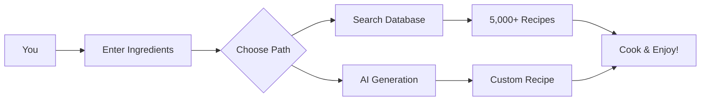

## 🌟 Welcome to **Smart Recipe**!

> *"The delightful web experience powered by the Recipe220 project"*

Smart Recipe helps you **discover**, **create**, and **cook** amazing meals: browse our **5,000+ recipe database**, or generate new recipes instantly from the ingredients you already have. 

<p align="center">
  
</p>

---

<div align="center">
  
</div>

## 📋 Table of Contents

<p align="center">
  <a href="#about"></a>
  <a href="#functionality"></a>
  <a href="#key-features"></a>
  <a href="#how-it-works"></a>
  <a href="#tech-stack"></a>
  <a href="#getting-started"></a>
  <a href="#developers"></a>
</p>

---

## 📖 About

Smart Recipe is a modern, friendly site built from the [Recipe220](https://github.com/AndriyPy/Recipe220) project. Its core idea: **combine a large curated recipe collection (5,000+ recipes) with an intelligent generator** that crafts recipe suggestions based on the exact ingredients you have on hand. 

Whether you want a tried-and-true classic or a brand-new creation, Smart Recipe helps you move from **pantry to plate** effortlessly.

---

## 🎯 Functionality

### 👥 **User Management**
<table>
  <tr>
    <td>✅ Registration with email verification</td>
    <td></td>
  </tr>
  <tr>
    <td>✅ Cloudflare Turnstile bot protection</td>
    <td></td>
  </tr>
  <tr>
    <td>✅ Google SSO authentication</td>
    <td></td>
  </tr>
  <tr>
    <td>✅ Profile editing (gender, birth date, country)</td>
    <td></td>
  </tr>
</table>

### 📚 **Recipes**
| Feature | Status | Badge |
|---------|--------|-------|
| Database of 5,000+ recipes | ✅ Ready |  |
| Fuzzy search (typo-tolerant) | ✅ Ready |  |
| Search by name & ingredients | ✅ Ready |  |
| Sorting (name, rating, time, servings) | 🔜 Soon |  |
| Recipe details page | 🔜 Soon |  |

### 🤖 **AI Assistant**
- ✨ Generate recipes based on available ingredients
- ✨ Personalized recommendations
- ✨ OpenRouter AI integration

### 📊 **Monitoring Stack**
<p align="center">
  
  
  
  
  
</p>
## Table of Contents
- [About](#about)
- [Functionality](#functionality)
- [KeyFeatures](#key-features)
- [How It Works](#how-it-works)
- [Tech Stack](#tech-stack)
- [Getting Started](#getting-started)
  - [Prerequisites](#prerequisites)
  - [Install & Run](#install--run)
- [Usage Examples](#usage-examples)
- [Database & Content](#database--content)
- [Contributing](#contributing)
- [License](#license)
- [Developers](#developers)
---

## ✨ Key Features

<div align="center">
  <table>
    <tr>
      <td align="center" width="200">
        <br/>
        <b>Smart Search</b><br/>
        <sub>Fuzzy search finds recipes even with typos</sub>
      </td>
      <td align="center" width="200">
        <br/>
        <b>AI Generator</b><br/>
        <sub>Create recipes from your ingredients</sub>
      </td>
      <td align="center" width="200">
        <br/>
        <b>Google SSO</b><br/>
        <sub>One-click login</sub>
      </td>
    </tr>
    <tr>
      <td align="center" width="200">
        <br/>
        <b>Full Monitoring</b><br/>
        <sub>Grafana + Prometheus stack</sub>
      </td>
      <td align="center" width="200">
        <br/>
        <b>Docker Ready</b><br/>
        <sub>Easy deployment with containers</sub>
      </td>
      <td align="center" width="200">
        <br/>
        <b>Bot Protection</b><br/>
        <sub>Cloudflare Turnstile</sub>
      </td>
    </tr>
  </table>
</div>

---

## 🔄 How It Works



---

## 🛠️ Tech Stack

<details>
<summary><b>Click to expand full tech stack</b></summary>

### **Backend**
<p align="center">
  
  
  
  
</p>

### **Frontend**
<p align="center">
  
  
  
  
</p>

### **DevOps**
<p align="center">
  
  
  
  
</p>

### **Monitoring**
<p align="center">
  
  
  
  
</p>

### **Integrations**
<p align="center">
  
  
  
  
</p>
</details>

---

## 🚀 Getting Started

### Prerequisites

| Tool | Version | Badge |
|------|---------|-------|
| Docker | 24.0+ |  |
| Python | 3.11+ |  |
| PostgreSQL | 15+ |  |

### 🐳 Install & Run (Docker)

```bash
# Clone the repository
git clone https://github.com/AndriyPy/Recipe220.git
cd Recipe220/project/monitoring

# Create .env file
cp .env.example .env
# Edit .env with your keys

# Start the project
docker-compose up -d

# Apply migrations
docker-compose exec web python manage.py migrate

# Create superuser
docker-compose exec web python manage.py createsuperuser
```

### 💻 Local Development

```bash
# Create virtual environment
python -m venv venv
source venv/bin/activate  # On Windows: venv\Scripts\activate

# Install dependencies
pip install -r requirements.txt

# Configure PostgreSQL and run
python manage.py migrate
python manage.py runserver
```

### 📊 Service Access

| Service | URL | Credentials |
|---------|-----|-------------|
| Django App | http://localhost:8000 | Your users |
| Django Admin | http://localhost:8000/admin | Superuser |
| Grafana | http://localhost:3000 | admin / admin |
| Prometheus | http://localhost:9090 | - |
| cAdvisor | http://localhost:8081 | - |

---

## 💡 Usage Examples

<details>
<summary><b>🔍 Search for recipes</b></summary>

```python
# Fuzzy search example
recipes = Recipe.objects.filter(name__icontains="chicken")
# Or use the built-in fuzzy search
results = recipe_search("chiken")  # Works even with typo!
```
</details>

<details>
<summary><b>🤖 Generate recipe with AI</b></summary>

```python
# Generate recipe from ingredients
ingredients = ["chicken", "rice", "onion", "garlic"]
ai_recipe = generate_recipe(ingredients)
print(f"Try this: {ai_recipe.name}")
```
</details>

---

## 📁 Database & Content

<p align="center">
  
  
  
  
</p>

Our database contains **over 5,000 carefully curated recipes**, each with:
- ✅ Title & description
- ✅ Ingredients list
- ✅ Preparation time
- ✅ Cooking time
- ✅ Rating system
- ✅ High-quality images

---

## 🤝 Contributing

Contributions are welcome! Here's how you can help:

<p align="center">
  <a href="#"></a>
  <a href="#"></a>
  <a href="#"></a>
</p>

1. Fork the repository
2. Create your feature branch (`git checkout -b feature/AmazingFeature`)
3. Commit your changes (`git commit -m 'Add some AmazingFeature'`)
4. Push to the branch (`git push origin feature/AmazingFeature`)
5. Open a Pull Request

---

## 📝 License

<p align="center">
  
</p>

This project is licensed under the MIT License - see the [LICENSE](LICENSE) file for details.

---

## 👨‍💻 Developers

<div align="center">
  <table>
    <tr>
      <td align="center" width="200">
        <a href="https://github.com/AndriyPy">
          <br/>
          <b>AndriyPy</b>
        </a>
        <br/>
        <sub>Backend Developer</sub>
        <br/>
        <a href="https://github.com/AndriyPy">
          
        </a>
      </td>
      <td align="center" width="200">
        <a href="https://github.com/pypok-1">
          <br/>
          <b>pypok-1</b>
        </a>
        <br/>
        <sub>DevOps / Monitoring</sub>
        <br/>
        <a href="https://github.com/pypok-1">
          
        </a>
      </td>
    </tr>
  </table>
</div>

---

<p align="center">
  
</p>

<p align="center">
  
  
</p>

<p align="center">
  <b>⭐ Star us on GitHub — it motivates us to cook more features! ⭐</b>
</p>
